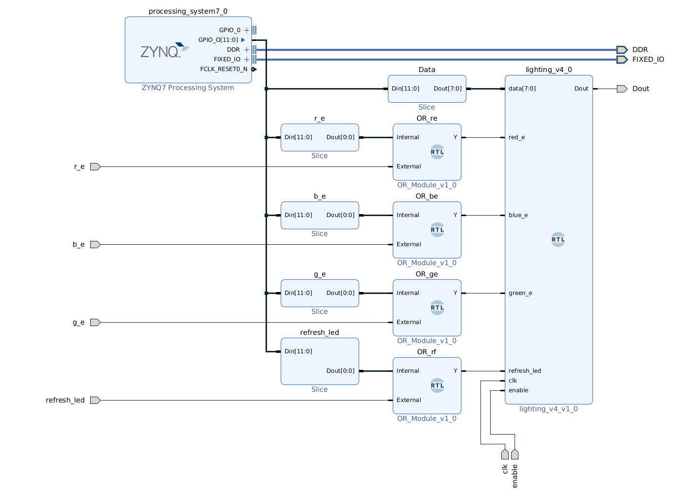

# WS2812b or Neopixel Driver for PYNQ-Z2 V2

## An implementation of NeoPxl driver

Finally a dynamic controller which is easy to implement and use. with lesser IO pins than V1, (reduced by around 50%)
An ic with higher pin count is hard to manage, synthesize and program.

## External Pin Layout

* Dout -> AR[0]
* enable -> SW[0]
* clk  -> H16 Pin from Eth PHY[Internal Oscillator] [125MHz]
* red_e -> btn[0]
* green_e -> btn[1]
* blue_e -> btn[2]
* refresh_led -> btn[3]

## Internal Pin Layout

* Data -> GPIO[7 0]
* red_e -> 8
* green_e -> 9
* blue_e -> 10
* refresh_led -> 11

## Usage

The data is fed into the data pin and the the x_e is toggled from [1 -> 0 -> 1 -> 0] casusing the data to be absorbed into x_v.
The implemented design has OR module to accept from both external and internal triggering.
refresh_led is supposed to be toggled inorder for the color to be absorbed into the module
I use PYNQ PS to input the RGB values to the module

## The Function implemented will accept (6-byte hex color value)

### Jupyter notebooks are shared having helper functions to help control the LEDs

this is based on Project of mine based on Lightdriver by anfractuosity modeled on a
circular ws2812b ring consisting of 24 LEDs

Demo is given Below.

Source is [pynq_ws2812b_v1](https://github.com/ZeroX29a/pynq_ws2812b_v1)
